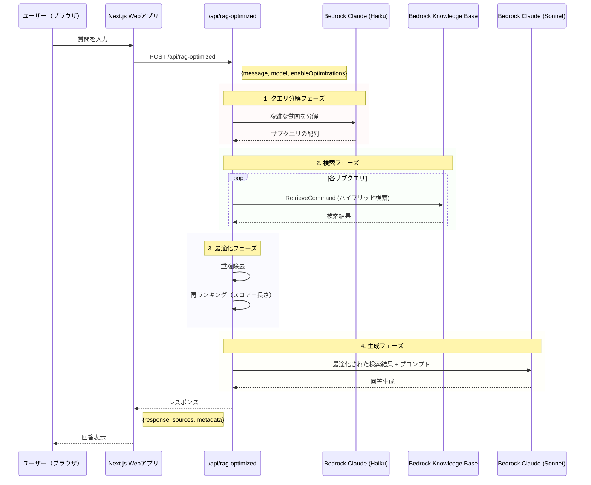

# RAG最適化APIアーキテクチャ

## システム全体の流れ



## データフローの詳細

### 1. リクエスト構造
```typescript
// ブラウザ → API
{
  message: "ユーザーの質問",
  model: "sonnet" | "haiku",
  enableOptimizations: true  // 最適化機能のON/OFF
}
```

### 2. クエリ分解（Optimization Phase 1）
```typescript
// 例：「東京の天気と観光地を教えて」
// ↓ Claude Haikuで分解
[
  "東京の天気",
  "東京の観光地"
]
```

### 3. Knowledge Base検索（Optimization Phase 2）
```typescript
// 各サブクエリで検索
retrievalConfiguration: {
  vectorSearchConfiguration: {
    numberOfResults: 5,
    overrideSearchType: 'HYBRID'  // セマンティック + キーワード
  }
}
```

### 4. 検索結果の最適化（Optimization Phase 3）
- **重複除去**: 同じコンテンツを統合
- **再ランキング**: スコア（70%）+ コンテンツ長（30%）で再評価

### 5. レスポンス構造
```typescript
// API → ブラウザ
{
  response: "生成された回答",
  sources: [
    {
      content: "ソースの内容",
      score: 0.95,
      uri: "s3://...",
      location: {...}
    }
  ],
  metadata: {
    searchQueries: ["東京の天気", "東京の観光地"],
    totalResults: 10,
    optimizationsApplied: [
      "query_decomposition",
      "hybrid_search", 
      "deduplication",
      "reranking"
    ]
  }
}
```

## AWS サービスの役割

### 1. **Bedrock Knowledge Base**
- ベクトルデータベース（Amazon OpenSearch）
- S3からのドキュメント取得
- ハイブリッド検索（セマンティック + キーワード）

### 2. **Bedrock Claude Models**
- **Claude Haiku**: 軽量・高速（クエリ分解用）
- **Claude Sonnet 3.5**: 高性能（回答生成用）

### 3. **処理の流れ**
```
ユーザー入力
    ↓
クエリ分解（Claude Haiku）
    ↓
並列検索（Knowledge Base × N回）
    ↓
結果の最適化（アプリ側）
    ↓
回答生成（Claude Sonnet）
    ↓
ユーザーへ返却
```

## 最適化のポイント

1. **クエリ分解**: 複雑な質問を単純な複数の質問に分解
2. **ハイブリッド検索**: より関連性の高い結果を取得
3. **並列処理**: 複数のサブクエリを同時検索
4. **重複除去**: 同じ情報の重複を排除
5. **再ランキング**: スコアとコンテンツの質で再評価

## 通常のAPIとの違い

| 機能 | /api/chat | /api/rag-optimized |
|-----|-----------|-------------------|
| クエリ分解 | ❌ | ✅ |
| 検索タイプ | ベクトルのみ | ハイブリッド |
| 検索回数 | 1回 | N回（サブクエリ数） |
| 結果数 | 5件 | 10件以上→10件に絞る |
| 再ランキング | ❌ | ✅ |
| 生成モデル制御 | 基本設定 | 詳細設定 |